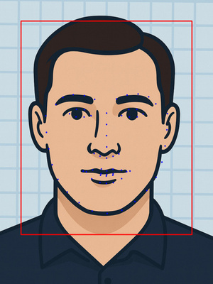

# FaceOFFx – PIV-Compliant Facial Processing for .NET

<p align="center">
  
</p>

<p align="center">
  <em>"I want to take his face... off."</em><br>
  — Castor Troy, <em>Face/Off</em> (1997)
</p>

<p align="center">
  <a href="#quick-start">Quick Start</a> •
  <a href="#installation">Installation</a> •
  <a href="#sample-gallery">Samples</a> •
  <a href="#api-reference">API</a> •
  <a href="#cli-usage">CLI</a> •
  <a href="#configuration">Configuration</a>
</p>

---

## About

FaceOFFx is a specialized, high-performance facial processing library for .NET, focused on **PIV (Personal Identity Verification)** compliance for government ID cards and credentials. Derived from the excellent **[FaceONNX](https://github.com/FaceONNX/FaceONNX)** library, FaceOFFx extends its capabilities with PIV-specific transformations, FIPS 201-3 compliance features, and advanced JPEG 2000 ROI encoding.

### Key Features

- **PIV/TWIC Compliance** - FIPS 201-3 compliant 420×560 output
- **JPEG 2000 ROI Encoding** - Smart compression with facial region priority  
- **68-Point Landmark Detection** - Precise facial feature mapping
- **High Performance** - Direct ONNX Runtime integration
- **Cross-Platform** - Windows, Linux, macOS via .NET 8
- **Self-Contained** - Embedded models, no external dependencies

## Quick Start

### Simple API - One Line Conversion

```csharp
using FaceOFFx.Core.Domain.Transformations;
using FaceOFFx.Infrastructure.Services;

// Initialize services (typically done via DI)
var faceDetector = new RetinaFaceDetector(modelPath);
var landmarkExtractor = new OnnxLandmarkExtractor(modelPath);
var jpeg2000Encoder = new Jpeg2000EncoderService();

// Convert JPEG to PIV-compliant JP2 with smart defaults
var result = await PivProcessor.ConvertJpegToPivJp2Async(
    "input.jpg",
    "output.jp2", 
    faceDetector,
    landmarkExtractor,
    jpeg2000Encoder);

if (result.IsSuccess)
{
    Console.WriteLine($"Success! File size: {result.Value.ImageData.Length:N0} bytes");
}
```

### Default Configuration
- **Output**: 420×560 pixels (PIV standard)
- **Format**: JPEG 2000 with ROI
- **File Size**: ~20KB
- **Quality**: Optimized for facial features

## Installation

### As a .NET Global Tool

```bash
# Install from NuGet
dotnet tool install --global FaceOFFx.Cli

# Update to latest version
dotnet tool update --global FaceOFFx.Cli
```

### As a Library (NuGet Package)

```bash
# Package Manager
dotnet add package FaceOFFx

# Package Manager Console
Install-Package FaceOFFx
```

### Requirements
- .NET 8.0 or later
- Windows, Linux, or macOS
- No GPU required (CPU inference supported)

## Sample Gallery

See the power of FaceOFFx with these real-world examples. All images processed with default settings (20KB, ROI Level 3).

| Original                                                            | PIV Processed                                                         | ROI Visualization                                             | Results                                                    |
|---------------------------------------------------------------------|-----------------------------------------------------------------------|---------------------------------------------------------------|------------------------------------------------------------|
|  |  |  | Size: 20,647 bytes<br>Rotation: 0.4°<br>Head width: 240px  |
|                |                |                | Size: 20,607 bytes<br>Rotation: 3.0°<br>Head width: 240px  |
|              |              |              | Size: 20,592 bytes<br>Rotation: 1.5°<br>Head width: 240px  |
|          |          |          | Size: 20,581 bytes<br>Rotation: 0.2°<br>Head width: 240px  |
|          |          |          | Size: 20,645 bytes<br>Rotation: -1.7°<br>Head width: 240px |

### Understanding the Visualizations

- **Green Box**: ROI region with highest quality preservation
- **Blue Line (AA)**: Vertical center alignment
- **Green Line (BB)**: Horizontal eye line (should be 55-60% from bottom)
- **Purple Line (CC)**: Head width measurement (minimum 240px) - always level for aesthetics

### Head Width Measurement (Line CC)

The head width measurement is crucial for PIV compliance but presents challenges with 68-point facial landmarks:

**What we measure**: The widest points of the face contour (landmarks 0-16), which represent the jawline from ear to ear. We then create a level line at the average Y-position of these widest points.

**Why this approach**: 
- The 68-point landmark model doesn't include true ear positions
- Using the widest jaw points provides a consistent measurement
- Leveling the line improves visual aesthetics while maintaining accurate width

**Limitations**:
- The measurement is typically lower than actual ear level
- True head width at the temples/ears may be wider
- This is a fundamental limitation of the 68-point model

**PIV Compliance**: The key requirement is that Line CC width ≥ 240 pixels. The exact vertical position is less critical than ensuring the face is large enough in the frame.

## API Reference

### Basic Usage

```csharp
// Load source image
using var sourceImage = await Image.LoadAsync<Rgba32>("photo.jpg");

// Process with default settings
var result = await PivProcessor.ProcessAsync(
    sourceImage,
    faceDetector,
    landmarkExtractor,
    jpeg2000Encoder);

if (result.IsSuccess)
{
    // Save the processed image
    await File.WriteAllBytesAsync("output.jp2", result.Value.ImageData);
}
```

### Advanced Usage with Custom Options

```csharp
// Configure processing options
var options = new PivProcessingOptions
{
    BaseRate = 0.8f,        // 24KB target
    RoiStartLevel = 2,      // Conservative ROI
    MinFaceConfidence = 0.9f
};

// Process with custom settings
var result = await PivProcessor.ProcessAsync(
    sourceImage,
    faceDetector,
    landmarkExtractor, 
    jpeg2000Encoder,
    options,
    enableRoi: true,        // Enable ROI encoding
    roiAlign: false,        // Smooth transitions
    logger);

// Access detailed results
if (result.IsSuccess)
{
    var pivResult = result.Value;
    
    // Transformation details
    Console.WriteLine($"Rotation: {pivResult.AppliedTransform.RotationDegrees}°");
    Console.WriteLine($"Scale: {pivResult.AppliedTransform.ScaleFactor}x");
    
    // Compliance validation
    var validation = pivResult.Metadata["ComplianceValidation"] as PivComplianceValidation;
    Console.WriteLine($"Head width: {validation?.HeadWidthPixels}px");
    Console.WriteLine($"Eye position: {validation?.BBFromBottom:P0} from bottom");
}
```

## Configuration

### Processing Options

| Option                 | Type  | Default | Description                                   |
|------------------------|-------|---------|-----------------------------------------------|
| `BaseRate`             | float | 0.7     | Compression rate in bits/pixel (0.6-1.0)      |
| `RoiStartLevel`        | int   | 3       | ROI quality level (0=aggressive, 3=smoothest) |
| `MinFaceConfidence`    | float | 0.8     | Minimum face detection confidence (0-1)       |
| `RequireSingleFace`    | bool  | true    | Fail if multiple faces detected               |
| `PreserveExifMetadata` | bool  | false   | Keep EXIF data in output                      |

### Preset Configurations

```csharp
// Optimized for ~20KB files with smooth quality transitions
var defaultOptions = PivProcessingOptions.Default;

// Maximum quality for archival (larger files)
var highQualityOptions = PivProcessingOptions.HighQuality;

// Fast processing with smaller files
var fastOptions = PivProcessingOptions.Fast;
```

### File Size Tuning

| Target Size | Base Rate | Use Case                                  |
|-------------|-----------|-------------------------------------------|
| ~17KB       | 0.6       | Maximum compression, basic ID cards       |
| ~20KB       | 0.7       | **Default**, optimal quality/size balance |
| ~24KB       | 0.8       | Enhanced quality for high-res printing    |
| ~30KB       | 1.0       | Premium quality for archival              |

## CLI Usage

### Basic Commands

```bash
# Process image with default settings (20KB, ROI enabled)
faceoffx process photo.jpg

# Specify output file
faceoffx process photo.jpg --output id_photo.jp2

# Generate ROI visualization
faceoffx roi photo.jpg --show-piv-lines
```

### Advanced Options

```bash
# Custom file size target (24KB)
faceoffx process photo.jpg --rate 0.8

# Disable ROI for uniform quality
faceoffx process photo.jpg --no-roi

# Different ROI quality levels
faceoffx process photo.jpg --roi-level 0  # Aggressive
faceoffx process photo.jpg --roi-level 2  # Conservative

# Enable ROI alignment (may create harsh boundaries)
faceoffx process photo.jpg --align

# Verbose output with debugging
faceoffx process photo.jpg --verbose --debug
```

### CLI Option Reference

| Option                | Description                | Default     |
|-----------------------|----------------------------|-------------|
| `--output <PATH>`     | Output file path           | `input.jp2` |
| `--rate <RATE>`       | Compression rate (0.6-1.0) | `0.7`       |
| `--roi-level <LEVEL>` | ROI priority (0-3)         | `3`         |
| `--no-roi`            | Disable ROI encoding       | ROI enabled |
| `--align`             | Enable ROI block alignment | Disabled    |
| `--verbose`           | Show detailed information  | Off         |
| `--debug`             | Enable debug logging       | Off         |

## Development

### Building from Source

```bash
# Clone the repository
git clone https://github.com/mistial-dev/FaceOFFx.git
cd FaceOFFx

# Build the solution
dotnet build

# Run tests
dotnet test

# Create NuGet package
dotnet pack --configuration Release
```

### Project Structure

```
FaceOFFx/
├── src/
│   ├── FaceOFFx.Core/           # Domain models and interfaces
│   ├── FaceOFFx.Infrastructure/ # ONNX implementations
│   ├── FaceOFFx.Application/    # Application services
│   ├── FaceOFFx.Models/         # Embedded ONNX models
│   └── FaceOFFx.Cli/           # Command-line interface
├── tests/                      # Unit and integration tests
└── docs/                       # Documentation and samples
```

## Technical Details

### PIV Compliance (FIPS 201-3)

FaceOFFx ensures compliance with government standards:

- **Output**: 420×560 pixels (3:4 aspect ratio)
- **Face Width**: Minimum 240 pixels
- **Eye Position**: 55-60% from bottom of image
- **Rotation**: Maximum ±5° correction
- **Centering**: Face properly centered with margins

### JPEG 2000 ROI Encoding

The library uses advanced ROI (Region of Interest) encoding to optimize quality:

1. **Inner Facial Region** - Highest quality for critical features
2. **Background** - Lower quality for non-facial areas
3. **Smooth Transitions** - Level 3 default prevents harsh boundaries

### ONNX Models

| Model                    | Purpose            | Input Size | Framework  |
|--------------------------|--------------------|------------|------------|
| `FaceDetector.onnx`      | Face detection     | 640×640    | RetinaFace |
| `landmarks_68_pfld.onnx` | Landmark detection | 112×112    | PFLD       |

## Requirements

- **.NET 8.0** or later
- **Dependencies**:
  - Microsoft.ML.OnnxRuntime (CPU inference)
  - SixLabors.ImageSharp (Image processing)
  - CoreJ2K (JPEG 2000 encoding)
  - CSharpFunctionalExtensions (Error handling)

## Contributing

Contributions are welcome! Please read our [Contributing Guide](docs/CONTRIBUTING.md) for details on our code of conduct and the process for submitting pull requests.

## Security and Supply Chain

### Software Bill of Materials (SBOM)

A complete Software Bill of Materials is available in [sbom/faceoffx-sbom.json](sbom/faceoffx-sbom.json) in CycloneDX format. This includes:
- All direct and transitive dependencies
- License information for each component
- Version information and checksums

### Security Policy

For security vulnerabilities, please see our [Security Policy](SECURITY.md).

## License

This project is licensed under the MIT License - see the [LICENSE](LICENSE) file for details.

## Acknowledgments & Credits

### Models and Software Used

| Component                      | Description                                                 | License      | Source/Credit                                                                                   |
|--------------------------------|-------------------------------------------------------------|--------------|-------------------------------------------------------------------------------------------------|
| **FaceONNX**                   | Base facial processing library this project is derived from | MIT          | [FaceONNX/FaceONNX](https://github.com/FaceONNX/FaceONNX)                                       |
| **RetinaFace**                 | Face detection model (FaceDetector.onnx)                    | MIT          | [discipleofhamilton/RetinaFace](https://github.com/discipleofhamilton/RetinaFace)               |
| **PFLD**                       | 68-point facial landmark detection (landmarks_68_pfld.onnx) | MIT          | [Hsintao/pfld_106_face_landmarks](https://github.com/Hsintao/pfld_106_face_landmarks)           |
| **ONNX Runtime**               | High-performance inference engine                           | MIT          | [Microsoft/onnxruntime](https://github.com/microsoft/onnxruntime)                               |
| **ImageSharp**                 | Cross-platform 2D graphics library                          | Apache-2.0   | [SixLabors/ImageSharp](https://github.com/SixLabors/ImageSharp)                                 |
| **CoreJ2K**                    | JPEG 2000 encoding with ROI support                         | BSD-2-Clause | [Efferent-Health/CoreJ2K](https://github.com/Efferent-Health/CoreJ2K)                           |
| **CSharpFunctionalExtensions** | Functional programming extensions                           | MIT          | [vkhorikov/CSharpFunctionalExtensions](https://github.com/vkhorikov/CSharpFunctionalExtensions) |
| **Spectre.Console**            | Beautiful console applications                              | MIT          | [spectreconsole/spectre.console](https://github.com/spectreconsole/spectre.console)             |

### Standards and Specifications

| Standard            | Description                                                 | Organization |
|---------------------|-------------------------------------------------------------|--------------|
| **FIPS 201-3**      | Personal Identity Verification (PIV) Requirements           | NIST         |
| **INCITS 385-2004** | Face Recognition Format for Data Interchange                | ANSI/INCITS  |
| **SP 800-76-2**     | Biometric Specifications for Personal Identity Verification | NIST         |

### Special Thanks

- **FaceONNX** - This project is derived from FaceONNX, which provides the foundational facial processing capabilities and model infrastructure
- The **68-point facial landmark** annotation scheme was originally developed by the iBUG group at Imperial College London
- **PIV Standards Community** for comprehensive compliance guidance

---

<p align="center">
  <em>Built with care for secure identity verification</em><br>
  <em>"Face... off... No more drugs for that man!"</em> - <a href="https://www.youtube.com/watch?v=3bdv8MjwzxA">Watch Scene</a>
</p>
